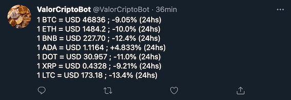

# @ValorCriptoBot

- [Acerca de](#acerca-de)
- [API](#api)
- [Fuentes](#fuentes)

## Acerca de
Bot que actualiza en tiempo real el precio distintas criptomonedas en USD.

Actualmente tiene BTC, ETH, BNB, ADA, DOT, XRP y LTC.

El proyecto está realizado en Python.

Se conecta a las APIs de Binance.

https://www.binance.com/es-LA

