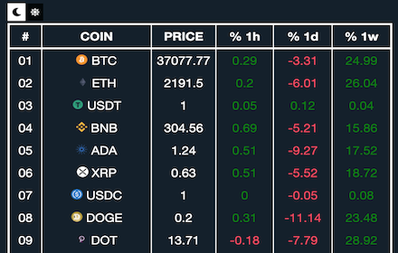

# @ValorCriptoBot

- [Acerca de](#acerca-de)
- [Contacto](#contacto)

## Acerca de
Aplicacion que muestra en tiempo real el precio distintas criptomonedas en USD.
Proyecto realizado con Python, HTML, JS y CSS.

_*hacer click en cada titulo para ir a las distintas aplicaciones_

[@ValorCriptoBot][twitter]
- Ver el precio de las top10 criptomonedas en base a mkt cap.
- Se puede recibir notificaciones personalizadas por DM.
- Recibir graficos de cambios de precios y porcentajes de cambio.
- Ver top ganadores y perdedores del dia. 

[Telegram][telegram]
- Grupo en el que se recibe actualizacion del precio de las top20 criptomonedas en base a mkt cap.

[Chrome Extension][extension]
- Extension para Google Chrome que tiene las top300 criptomonedas.
- Ver cambio de precio en 1 hora, 1 dia y 1 semana.

## Contacto
- Twitter: [twitter]
- Cafecito: [cafecito]

[binance]: https://www.binance.com/es-LA
[twitter]: https://twitter.com/ValorCriptoBot
[telegram]: https://t.me/valor_cripto_bot
[extension]: https://chrome.google.com/webstore/detail/valorcriptobot/hgnfiejekiilbchdomcjkmffnbjlbflc?hl=es
[cafecito]: https://cafecito.app/valorcriptobot#

