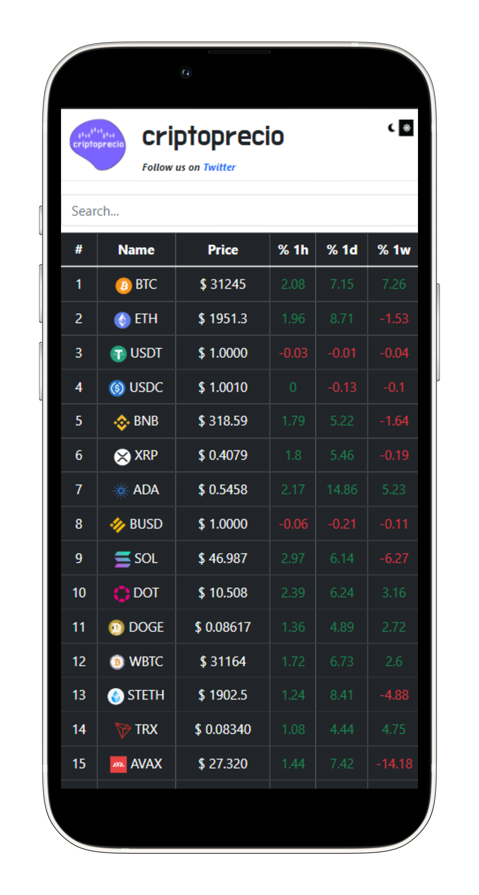

# @criptoprecio

## Acerca de
Crypto, Blockchain, NFTs & DeFi information in real time.

[Twitter][twitter]
- Ver el precio de las top criptomonedas en base a mkt cap.
- Graficos de cambios diarios.
- Se puede recibir notificaciones personalizadas.
- Ver top ganadores y perdedores del dia.
- Información de CEXs, DEXs y DeFi protocols.  

#
[Telegram][telegram]
- Grupo en el que se recibe actualizacion del precio de las top criptomonedas en base a mkt cap.

#
[Aplicación Web][app]
- Un sitio donde no solo vas a ver precios y variaciones, sino que tambien vas a poder comparar cotizaciones en distintos exchanges.

#
[Chrome Extension][extension]
- Extension para Google Chrome que tiene las top criptomonedas.
- Ver cambio de precio en 1 hora, 1 dia y 1 semana.
- Posibilidad de agregar favoritas a lista de seguimiento.

#
[Widget][widget]
Simplemente se debe copiar la siguiente linea de codigo:
> <iframe src="https://critoprecio-widget.netlify.app" style="display:block; width:340px; height:320px;" frameborder="0"></iframe> 

## Contacto
- Twitter: [twitter]
- Cafecito: [cafecito]

[app]: https://criptoprecio.netlify.app/
[twitter]: https://twitter.com/criptoprecio
[telegram]: https://t.me/cripto_precio
[extension]: https://chrome.google.com/webstore/detail/valorcriptobot-crypto-tra/hgnfiejekiilbchdomcjkmffnbjlbflc
[cafecito]: https://cafecito.app/criptoprecio
[widget]: https://github.com/cocomiranda/criptoprecio_widget

